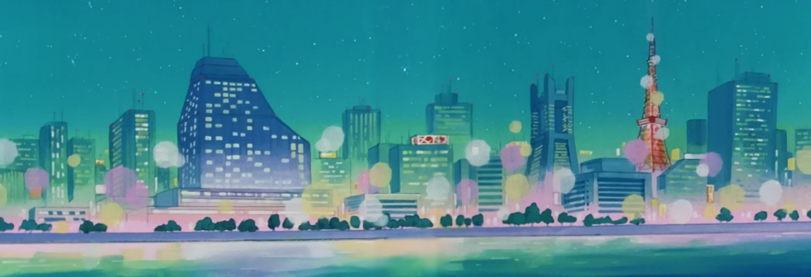
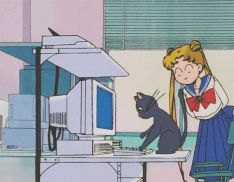
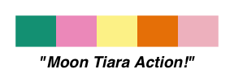
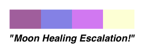
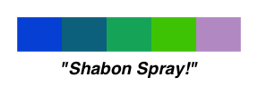
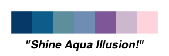
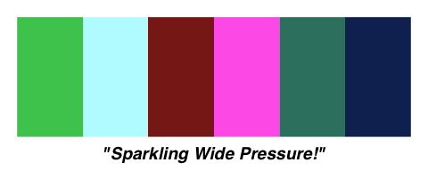
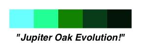
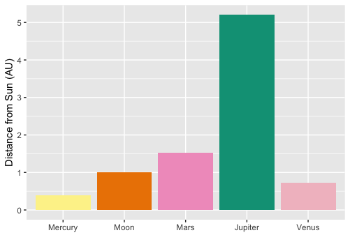
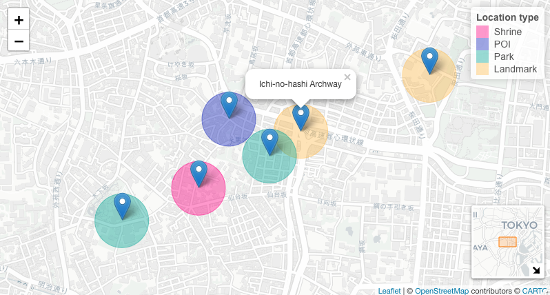

SailorMoonR
================



Transform your R plots and graphics with the magical colors of Sailor
Moon\!
🌙✨🌸

## Installation

``` r
install.packages("devtools") #If you don't already have devtools installed

devtools::install_github("morgansleeper/SailorMoonR")
```



## Using SailorMoonR

``` r
#Load SailorMoonR
library(SailorMoonR)
```

**Functions:**

  - `MoonPaletteEnumeration`: list all available palettes
  - `MoonPaletteIllumination()`: generate a sample swatch for a palette
  - `inthenameofthemoon()`: use a palette (by having it return its color
    values)

<!-- end list -->

``` r
# See all available palettes
MoonPaletteEnumeration
>  [1] "MoonPrismPower"        "MoonTiaraAction"       "MoonHealingEscalation"
>  [4] "MoonPrincessHalation"  "ShabonSpray"           "ShineAquaIllusion"    
>  [7] "AkuryoTaisan"          "FireSoul"              "SparklingWidePressure"
> [10] "JupiterOakEvolution"   "VenusLoveMeChain"      "CrescentBeam"         
> [13] "MinatoDaylight"        "MinatoSunset"          "MinatoMoonlight"      
> [16] "TokyoTower"

# See a sample swatch for a palette
MoonPaletteIllumination("MoonPrismPower")
```

<!-- -->

``` r
# Use a palette
inthenameofthemoon("MoonPrismPower")
> [1] "#FF0083" "#0C1EB8" "#00A294" "#FFBC4D"
```

**Prism:**

If you need more colors than a given palette offers, you can generate a
larger palette by adding the `prism` argument:

``` r
#Expand a palette with prism
inthenameofthemoon("CrescentBeam", prism=6)
> [1] "#862699" "#357BA9" "#00B2BD" "#00A9D8" "#56C9ED" "#D7FEFF"

MoonPaletteIllumination("MinatoSunset", prism=128)
```

<!-- -->

## Palettes

### Sailor Moon 🌙

``` r
inthenameofthemoon("MoonPrismPower")
```


``` r
inthenameofthemoon("MoonTiaraAction")
```



``` r
inthenameofthemoon("MoonHealingEscalation")
```



``` r
inthenameofthemoon("MoonPrincessHalation")
```


### Sailor Mercury ☿

``` r
inthenameofthemoon("ShabonSpray")
```



``` r
inthenameofthemoon("ShineAquaIllusion")
```



### Sailor Mars ♂️

``` r
inthenameofthemoon("AkuryoTaisan")
```


``` r
inthenameofthemoon("FireSoul")
```


### Sailor Jupiter ♃

``` r
inthenameofthemoon("SparklingWidePressure")
```



``` r
inthenameofthemoon("JupiterOakEvolution")
```



### Sailor Venus ♀️

``` r
inthenameofthemoon("VenusLoveMeChain")
```


``` r
inthenameofthemoon("CrescentBeam")
```


### Tokyo 🌃

``` r
inthenameofthemoon("MinatoDaylight")
```


``` r
inthenameofthemoon("MinatoSunset")
```


``` r
inthenameofthemoon("MinatoMoonlight")
```


``` r
inthenameofthemoon("TokyoTower")
```


## Examples

### ggplot2 📊

``` r
library(ggplot2)

ggplot(distances, aes(x=Planet, y=Distance, fill=Planet)) + 
  geom_col() +
  xlab("") + ylab("Distance from Sun (AU)") +
  scale_fill_manual(values = inthenameofthemoon("MoonTiaraAction")) +
  guides(fill=FALSE)
```



### leaflet 🗺

``` r
library(leaflet)

#Set up color palette
pal <- colorFactor(palette = (col=(inthenameofthemoon("MoonPrismPower"))), domain = locs$Type)

#Draw map
leaflet(locs) %>%
  addProviderTiles(providers$CartoDB.Positron) %>%
  addMarkers(label=~Name) %>%
  addCircles(radius=150, weight=1, color=~pal(Type)) %>%
  addLegend("topright", pal = pal, values = ~locs$Type, title = "Location type", opacity = .4) %>%
  addMiniMap("bottomright", width=100, height=100, tiles = providers$CartoDB.Positron)
```



## Acknowledgments

Project inspired by Karthik Ram’s [Wes Anderson
Palettes](https://github.com/karthik/wesanderson) package.

Written using and pairs nicely with sailorhg’s
[fairyfloss](https://github.com/sailorhg/fairyfloss) theme (RStudio
version [here](https://github.com/gadenbuie/rsthemes)).

*Sailor Moon © Naoko Takeuchi.*
